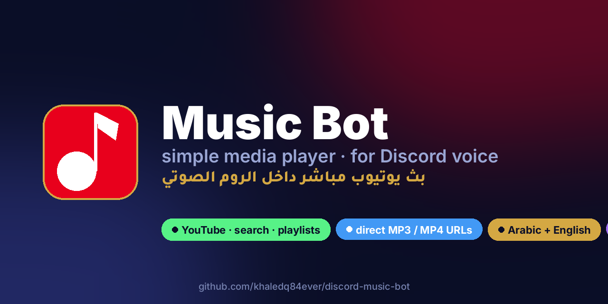
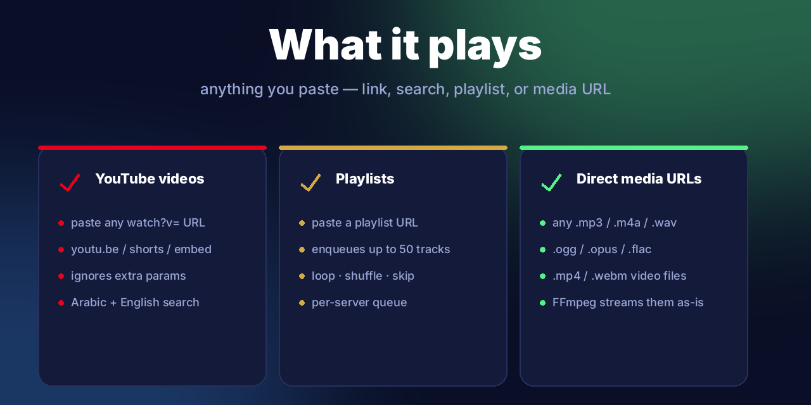
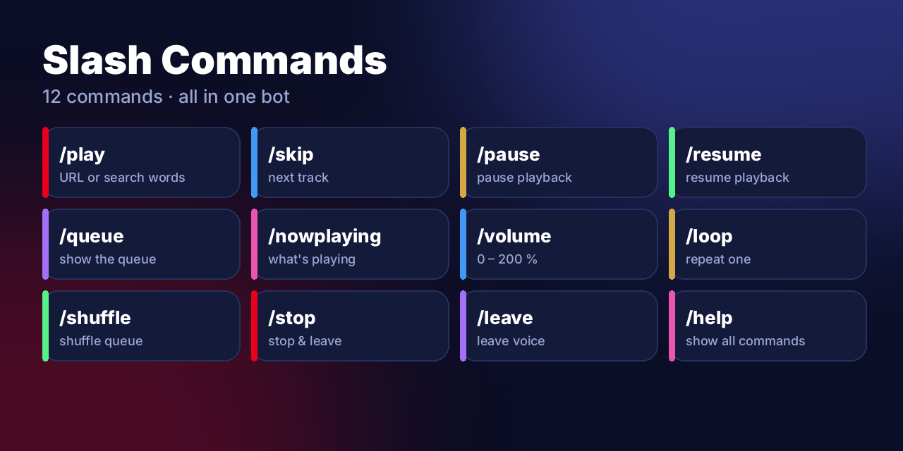
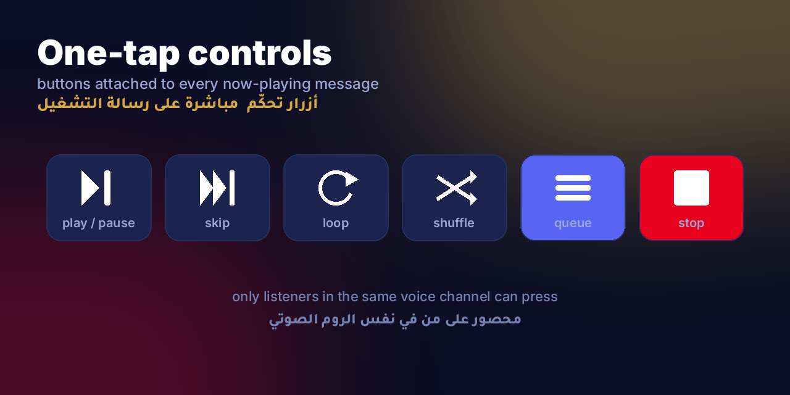
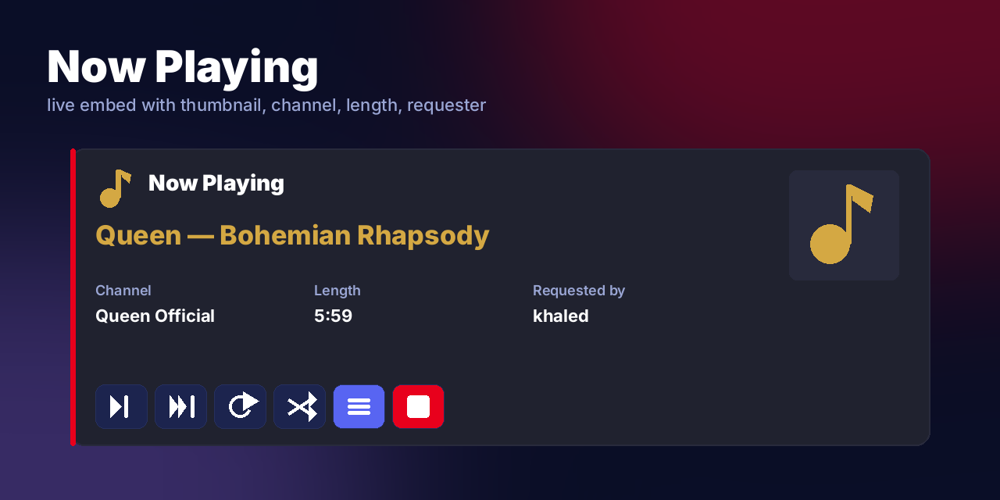
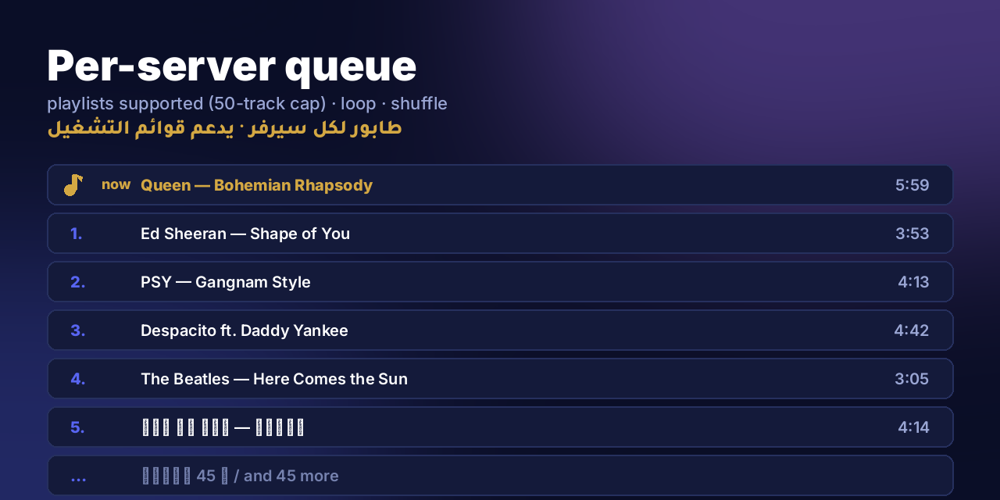
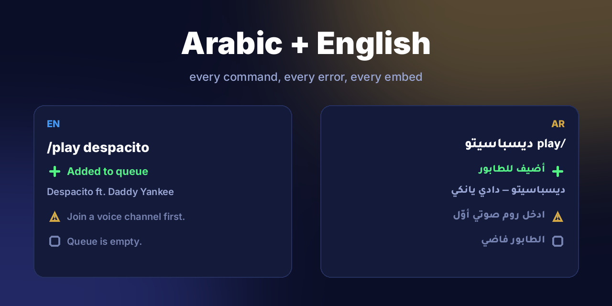
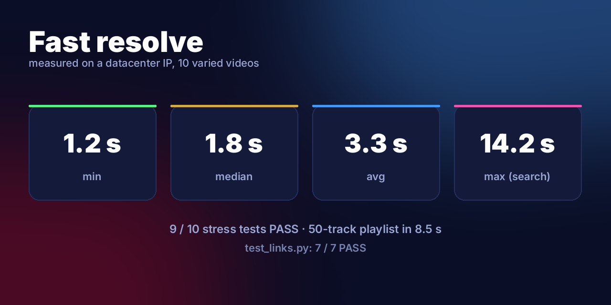
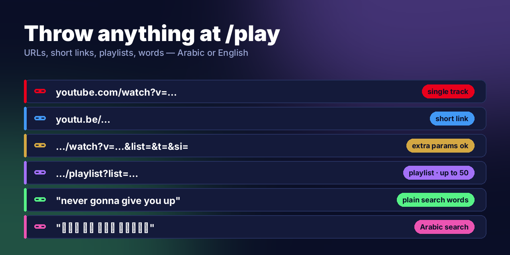
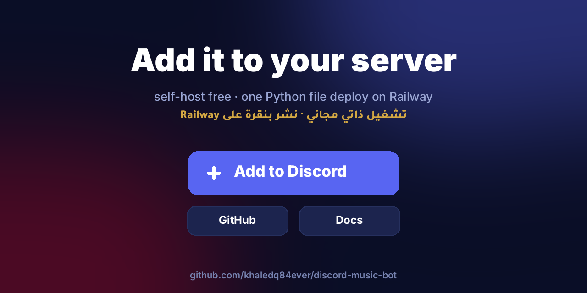

<div align="center">



# 🎵 Music Bot — for Discord

**A simple media player for Discord voice channels. Arabic + English.**

شغّل أي أغنية من يوتيوب داخل الروم الصوتي — بدون أي إعدادات، يشتغل من أوّل مرة

[](#-add-to-your-server)
[](https://github.com/khaledq84ever/discord-music-bot)
[](https://railway.app)
[](https://www.python.org)

</div>

---

## ✨ What it is

A simple, no-fuss media player that lives in your Discord server. Type `/play` with anything — a YouTube link, a playlist, a few search words, or a direct `.mp3` URL — and the audio plays in your voice channel. That's it.

<div align="center">

</div>

---

## ⚡ Slash commands — 12 in one bot

<div align="center">

</div>

| Command | What it does |
|---|---|
| `/play <url \| words>` | Play a YouTube or Spotify link, a direct media URL, or search by words |
| `/skip` | Skip the current track |
| `/pause` · `/resume` | Pause / resume playback |
| `/queue` | Show the current queue (top 10 + count) |
| `/nowplaying` | Re-post the current track embed |
| `/volume <0–200>` | Adjust playback volume |
| `/loop` | Toggle repeat-one on the current track |
| `/shuffle` | Shuffle the queue |
| `/stop` | Stop, clear the queue, leave the voice channel |
| `/leave` | Leave the voice channel |
| `/help` | Show all commands |

---

## 🎛️ One-tap controls

Every now-playing message comes with **vector-icon buttons** — same UI on every client. Only listeners in the same voice channel can press them.

<div align="center">

<br><br>

</div>

---

## 📜 Per-server queue + playlists

Paste a full YouTube or Spotify playlist/album URL and the bot enqueues up to **50 tracks** at once, resolving each one lazily right before it plays. Spotify links resolve via Spotify's own public embed page (no API key), then each track title is matched to its audio on YouTube — same lazy resolution as any playlist.

<div align="center">

</div>

---

## 🌐 Arabic + English, everywhere

Every command description, every error message, every embed — both languages. Arabic is shaped properly via libraqm so it renders fully cursive/connected (not the disconnected presentation-form fallback).

<div align="center">

</div>

---

## ⏱️ Fast — proven, not promised

`test_loop10.py` runs 10 varied YouTube videos + a 50-track playlist end-to-end with real HTTP timings.

<div align="center">

</div>

```text
test_links.py     8 / 8  PASS    (YouTube, playlists, search, direct .mp3, removed videos)
test_loop10.py    9 / 10 PASS    +  50-track playlist in ~9 s
                  ↳ the only failure is a 24/7 livestream
                    (live streams aren't supported by design)
```

---

## 🔗 What you can paste at `/play`

<div align="center">

</div>

- `youtube.com/watch?v=…` — single track
- `youtu.be/…` — short link
- `…/watch?v=…&list=&t=&si=` — extra params are fine
- `…/playlist?list=…` — YouTube playlist (up to 50 tracks)
- `open.spotify.com/track/…` — single Spotify track
- `open.spotify.com/playlist/…` · `…/album/…` — Spotify playlist/album (up to 50 tracks)
- `https://example.com/song.mp3` — direct audio file (.mp3, .m4a, .wav, .ogg, .opus, .flac)
- `https://example.com/video.mp4` — direct video file (audio gets streamed)
- `"never gonna give you up"` — plain search words (English or Arabic)

---

## 🚀 Add to your server

<div align="center">

</div>

### Self-host in 60 seconds

1. **Create a Discord app** → https://discord.com/developers/applications
   - *Bot → Reset Token* → copy the token
   - *General Information* → copy the **Application ID**
   - You do **not** need the `MESSAGE_CONTENT` intent (slash-only)
2. **Clone + configure:**
   ```bash
   git clone https://github.com/khaledq84ever/discord-music-bot.git
   cd discord-music-bot
   cp .env.example .env
   # fill in DISCORD_TOKEN and APPLICATION_ID
   ```
3. **Deploy to Railway:**
   ```bash
   railway init -n discord-music-bot
   railway up --detach
   ```
   The included `Dockerfile` installs Python, FFmpeg, and PyNaCl. No further setup.

### Run it locally

```bash
python3 -m venv .venv
source .venv/bin/activate
pip install -r requirements.txt
sudo apt install ffmpeg          # Linux
brew install ffmpeg              # macOS
python3 bot.py
```

---

## 📂 Project layout

```
discord-music-bot/
├── bot.py            # 12 slash commands
├── player.py         # GuildPlayer (queue + FFmpeg loop) + MusicControls (button view)
├── ytdl.py           # media resolver (YouTube + playlists + direct URLs + Spotify)
├── config.py         # env-driven config
├── test_links.py     # 8-case link-type matrix
├── test_loop10.py    # 10 varied videos + 50-track playlist stress
├── Dockerfile        # Python + FFmpeg + PyNaCl
├── railway.json      # Railway service config (worker, no public port)
├── web/index.html    # Arabic-first landing page (Vercel/Railway deployable)
└── assets/
    ├── fonts/        # Inter (Latin) + Tajawal (Arabic)
    ├── make_promo.py # 10 vector-drawn promo images
    └── promo/        # generated PNGs
```

---

## 🧪 Verification

Reproduce the published numbers yourself:

```bash
python3 test_links.py     # 8 link shapes (YouTube URL/short/playlist/search/direct .mp3/removed/invalid)
python3 test_loop10.py    # 10 popular YouTube videos + a real playlist
```

Both scripts print the actual resolved stream URL and HEAD-check it to prove it's real audio. No mocks.

---

## ⚠️ Known limits

- **Live streams don't work.** The YouTube pipeline only handles finished videos; 24/7 lo-fi streams will fail gracefully (the player loop continues to the next track).
- **Playlist cap = 50** by default (configurable via `PLAYLIST_LIMIT` in `ytdl.py`).
- **Spotify has no audio API** (DRM) — the bot resolves the track title from Spotify's public embed page, then plays the closest YouTube match for that title/artist. It's a title match, not the literal Spotify master, and a handful of tracks per playlist may fail to match or hit YouTube's bot-check; the player skips those and keeps going.
- **Search words** use the public YouTube results page — fast but YouTube may rate-limit if abused. URL pastes don't hit search.
- **No persistence.** Queues live in memory; restarting the bot clears them. By design.

---

## 📜 License

MIT — do whatever you want.

---

<div align="center">

**Made for Arabic Discord servers · works for everyone else too.**

[GitHub](https://github.com/khaledq84ever/discord-music-bot) · [Sister bot — AI chat](https://github.com/khaledq84ever/discord-ai-bot) · [@KhaledQ84Ever](https://x.com/KhaledQ84Ever)

</div>
