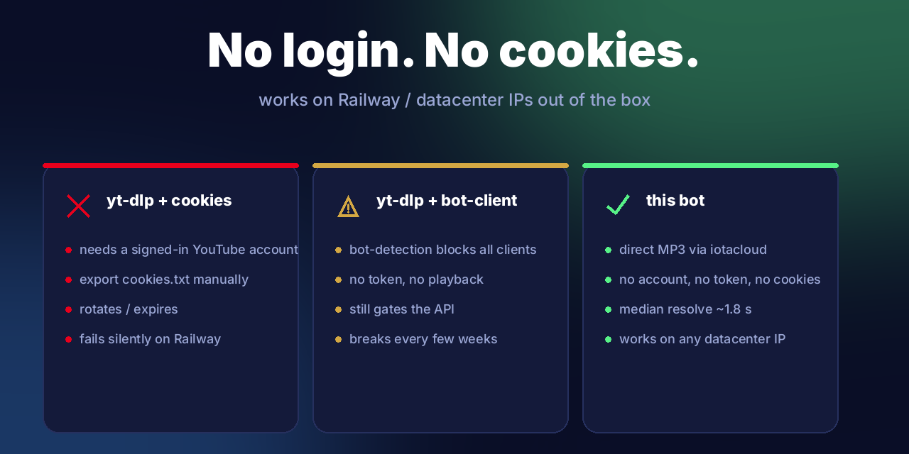

<div align="center">


# 🎵 Music Bot — for Discord

**Cookie-free YouTube player. Datacenter-IP friendly. Arabic + English.**

شغّل أي أغنية من يوتيوب داخل الروم الصوتي — بدون حساب، بدون كوكيز، يشتغل على Railway

[](#-add-to-your-server)
[](https://github.com/khaledq84ever/discord-music-bot)
[](https://railway.app)
[](https://www.python.org)

</div>

---

## ✨ Why this bot exists

Every popular YouTube music bot on Discord either died (Groovy, Rythm, Hydra), needs a logged-in YouTube account (`cookies.txt`), or breaks on datacenter IPs because YouTube returns *"Sign in to confirm you're not a bot."*

**This one doesn't.** It resolves a fresh signed direct-MP3 URL through the `v3.y2mate.nu → iotacloud.org` pipeline and streams it straight into your voice channel via FFmpeg. No account. No cookies. No download to disk. Median resolve **~1.8 seconds** on a datacenter IP.

<div align="center">

</div>

---

## ⚡ Slash commands — 12 in one bot

<div align="center">

</div>

| Command | What it does |
|---|---|
| `/play <url \| words>` | Play a YouTube URL or search by words — joins your voice channel |
| `/skip` | Skip the current track |
| `/pause` · `/resume` | Pause / resume playback |
| `/queue` | Show the current queue (top 10 + count) |
| `/nowplaying` | Re-post the current track embed |
| `/volume <0–200>` | Adjust playback volume |
| `/loop` | Toggle repeat-one on the current track |
| `/shuffle` | Shuffle the queue |
| `/stop` | Stop, clear the queue, leave the voice channel |
| `/leave` | Leave the voice channel |
| `/help` | Show all commands |

---

## 🎛️ One-tap controls

Every now-playing message comes with **vector-icon buttons** — no emoji-glyph headaches, same UI on every client. Only listeners in the same voice channel can press them.

<div align="center">

<br><br>

</div>

---

## 📜 Per-server queue + playlists

Paste a full YouTube playlist URL and the bot enqueues up to **50 tracks** at once, resolving each stream lazily right before it plays so signed URLs never expire on you.

<div align="center">

</div>

---

## 🌐 Arabic + English, everywhere

Every command description, every error message, every embed — both languages. Arabic is shaped properly via libraqm so it renders fully cursive/connected (not the disconnected presentation-form fallback).

<div align="center">

</div>

---

## ⏱️ Fast — proven, not promised

`test_loop10.py` runs 10 varied videos + a 50-track playlist end-to-end on a datacenter IP. Times are real HTTP timings, not vibes.

<div align="center">

</div>

```text
test_links.py     7 / 7  PASS
test_loop10.py    9 / 10 PASS  +  50-track playlist in 8.5 s
                  ↳ the only failure is a 24/7 livestream
                    (can't be MP3-converted by design)
```

---

## 🔗 Supported link types

<div align="center">

</div>

---

## 🚀 Add to your server

<div align="center">

</div>

### Self-host in 60 seconds

1. **Create a Discord app** → https://discord.com/developers/applications
   - *Bot → Reset Token* → copy the token
   - *General Information* → copy the **Application ID**
   - You do **not** need the `MESSAGE_CONTENT` intent (slash-only)
2. **Clone + configure:**
   ```bash
   git clone https://github.com/khaledq84ever/discord-music-bot.git
   cd discord-music-bot
   cp .env.example .env
   # fill in DISCORD_TOKEN and APPLICATION_ID
   ```
3. **Deploy to Railway:**
   ```bash
   railway init -n discord-music-bot
   railway up --detach
   ```
   The included `Dockerfile` installs Python, FFmpeg, and PyNaCl. No further setup.

### Run it locally

```bash
python3 -m venv .venv
source .venv/bin/activate
pip install -r requirements.txt
sudo apt install ffmpeg          # Linux
brew install ffmpeg              # macOS
python3 bot.py
```

---

## 🏗️ How it works (the cookie-free trick)

```
       you paste a YouTube link
                 │
                 ▼
        ┌──────────────────┐
        │  v3.y2mate.nu    │   priming GET → kicks off backend conversion
        └────────┬─────────┘
                 ▼
        ┌──────────────────┐
        │ iotacloud.org/   │   poll /api/?r=1..7&v=<id>
        │ api/ (signed)    │   returns { progress:'completed', url:'<signed MP3>' }
        └────────┬─────────┘
                 ▼
        ┌──────────────────┐
        │      FFmpeg      │   streams the MP3 straight into Discord voice
        └──────────────────┘
```

No `yt-dlp`. No browser. No login. No download to disk — FFmpeg streams the URL inline.

---

## 📂 Project layout

```
discord-music-bot/
├── bot.py            # 12 slash commands
├── player.py         # GuildPlayer (queue + FFmpeg loop) + MusicControls (button view)
├── ytdl.py           # cookie-free resolver (oEmbed + iotacloud + YT search scrape)
├── config.py         # env-driven config
├── test_links.py     # 7-case link-type matrix
├── test_loop10.py    # 10 varied videos + 50-track playlist stress
├── Dockerfile        # Python + FFmpeg + PyNaCl
├── railway.json      # Railway service config (worker, no public port)
├── web/index.html    # Arabic-first landing page (deployable to Vercel/Railway)
└── assets/
    ├── fonts/        # Inter (Latin) + Tajawal (Arabic)
    ├── make_promo.py # this README's 10 images, vector-drawn
    └── promo/        # generated PNGs
```

---

## 🧪 Verification

Reproduce the published numbers yourself:

```bash
python3 test_links.py     # 7 link shapes (URL / short / playlist / search / removed / invalid)
python3 test_loop10.py    # 10 popular tracks + a real playlist, with per-case timings
```

Both scripts print the actual resolved signed URL and HEAD the stream to prove it's `Content-Type: audio/mpeg`. No mocks.

---

## ⚠️ Known limits

- **Live streams don't work.** The MP3 pipeline only produces finished files; 24/7 lo-fi streams and the like will fail gracefully (the player loop continues to the next track).
- **Playlist cap = 50** by default (configurable via `PLAYLIST_LIMIT` in `ytdl.py`).
- **Search words** use the public YouTube results page — fast but YouTube may rate-limit if abused. URL pastes don't hit search and are always free.
- **No persistence.** Queues live in memory; restarting the bot clears them. By design.

---

## 📜 License

MIT — do whatever you want, just don't blame me if YouTube changes the rules.

---

<div align="center">

**Made for Arabic Discord servers · works for everyone else too.**

[GitHub](https://github.com/khaledq84ever/discord-music-bot) · [Sister bot — AI chat](https://github.com/khaledq84ever/discord-ai-bot) · [@KhaledQ84Ever](https://x.com/KhaledQ84Ever)

</div>
